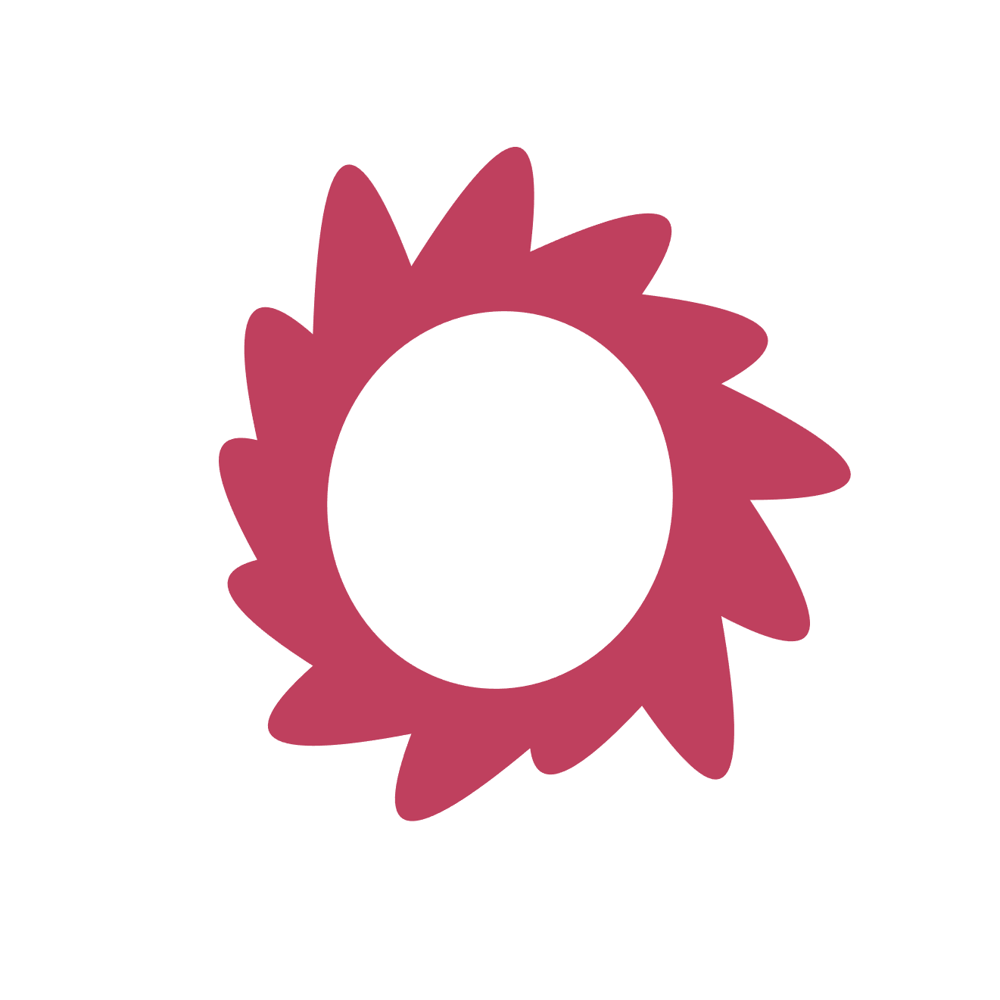

# Genuary 2026

## Prompts

https://genuary.art/prompts

### JAN. 1 (credit: Piero)

One color, one shape.

### JAN. 2 (credit: Anna Lucia)

[Twelve principles of animation](https://en.wikipedia.org/wiki/Twelve_basic_principles_of_animation).

### JAN. 3 (credit: PaoloCurtoni)

Fibonacci forever. Create a work that uses the [Fibonacci sequence](https://en.wikipedia.org/wiki/Fibonacci_sequence) in some way.

### JAN. 4 (credit: Manuel Larino)

Lowres. An image or graphic with low resolution, where details are simplified or pixelated.

### JAN. 5 (credit: Piero)

Write “Genuary”. Avoid using a font.

### JAN. 6 (credit: George Henry Rowe)

Lights on/off. Make something that changes when you switch on or off the “digital” lights.

### JAN. 7 (credit: PaoloCurtoni)

Boolean algebra. Get inspired by [Boolean algebra](https://en.wikipedia.org/wiki/Boolean_algebra), in any way.

### JAN. 8 (credit: PaoloCurtoni)

A City. Create a generative metropolis.

### JAN. 9 (credit: PaoloCurtoni)

Crazy automaton. Cellular automata with crazy rules.

### JAN. 10 (credit: Sophia (fractal kitty))

Polar coordinates.

### JAN. 11 (credit: Manuel Larino)

Quine. A Quine is a form of code poetry, it’s a computer program that outputs exactly its own source code.

### JAN. 12 (credit: Stranger in the Q)

Boxes only.

### JAN. 13 (credit: Jos Vromans)

Self portrait. For example, get started with a very basic human face, a few circles or oval shapes. How far can you improve this by adding features that actually look like you. Try adding eyes, eyelashes, hair, and make a few parameters or colors variable. Even though you are aiming for a self portrait, it might be fun to render some random variations as well.

### JAN. 14 (credit: Roni)

Everything fits perfectly.

### JAN. 15 (credit: P1xelboy)

Create an invisible object where only the shadows can be seen.

### JAN. 16 (credit: Ivan Dianov)

Order and disorder.

### JAN. 17 (credit: Ivan Dianov)

Wallpaper group. There are only 17 ways to cover a plane with a repeating pattern, choose your favourite on this page: Wallpaper group.

### JAN. 18 (credit: Baret LaVida)

Unexpected path. Draw a route that changes direction based on one very simple rule.

### JAN. 19 (credit: Jos Vromans)

16x16

### JAN. 20 (credit: Jos Vromans)

One line. An artwork that is made of a single line only.

### JAN. 21 (credit: Piero)

Bauhaus Poster. Create a poster design inspired by the German art school Bauhaus.

### JAN. 22 (credit: Sophia (fractal kitty))

Pen plotter ready.

> What if I don’t have a plotter? A work is considered “plotter ready” if it can be drawn using a plotter. That’s a drawing robot holding a pen. Kind of like a 3D printer, except for 2D. The limitation here is that a plotter can only draw lines. And also that it cannot erase lines. It can also not draw over the same spot 20 times because the robot doesn’t care and the pen will rip through the paper. In theory you can draw a dot with a very short line or small circle, however it takes a small but non-trivial amount of time to lift up the pen and lower it again, so if you have 50 000 dots, this will take a lot of time. Another thing is that changing pens is a hassle, so you don’t want to do that too often, preferably not at all. It’s also hard to make sure each new pen is neatly aligned with the earlier ones. Generally plotter artists use SVG files to represent their plots. However, you don’t get to use the fancy SVG filters or anything. In fact you don’t get to use the fill attribute! Because only lines, which includes having to use lines to hatch any filled areas. Now you might wonder why people even bother. The upside of plotters is that they are ridiculously precise and can draw with a super fine 0.25mm line on a 297x420 (A3) paper or larger, that you can get more interesting textures than printers (using e.g. ballpoint or fountain pens). And they work at night even when you’re not looking. Another upside is that if you didn’t know SVG, you only need to know a super tiny bit about SVG, because you only need/get to draw lines.

### JAN. 23 (credit: PaoloCurtoni)

Transparency. Explore the concept of transparency.

### JAN. 24 (credit: Sophia (fractal kitty))

Perfectionist’s nightmare.

### JAN. 25 (credit: Manuel Larino)

Organic Geometry. Forms that look or act organic but are constructed entirely from geometric shapes.

### JAN. 26 (credit: Piero)

Recursive Grids. Split the canvas into a grid of some kind and recurse on each cell again and again.

### JAN. 27 (credit: Manuel Larino)

Lifeform. A shape or structure that behaves as if it’s alive or growing.

### JAN. 28 (credit: Piero)

No libraries, no canvas, only HTML elements.

> If you want to cheat and say that `<canvas>` or `<svg>` or even `` are perfectly fine HTML elements, just remember that nobody ever hears the Genuary Police. I mean, has heard about the Genuary Police. It’s not true and there’s no such thing, stop asking. Anyhow, I don’t know have you heard about `
`’s? I heard they are pretty cool. Good luck!

### JAN. 29 (credit: Monokai)

Genetic evolution and mutation.

### JAN. 30 (credit: Bart Simons)

Its not a bug, its a feature.

### JAN. 31 (credit: Piero)

GLSL day. Create an artwork using only shaders.

https://pifragile.com/
https://mlarino.com/
https://monokai.com/
https://www.bartsimons.com/
https://www.fractalkitty.com/
https://www.paolocurtoni.com/
https://www.josvromans.art/
https://www.artbaret.com/
https://ivandianov.com/
https://linktr.ee/p1x3lboy
https://ronikaufman.github.io/
https://strangerintheq.art/
https://georgehenryrowe.co.uk/
https://annalucia.io/

Made with :heart: by [AzazelN28](https://github.com/azazeln28)
